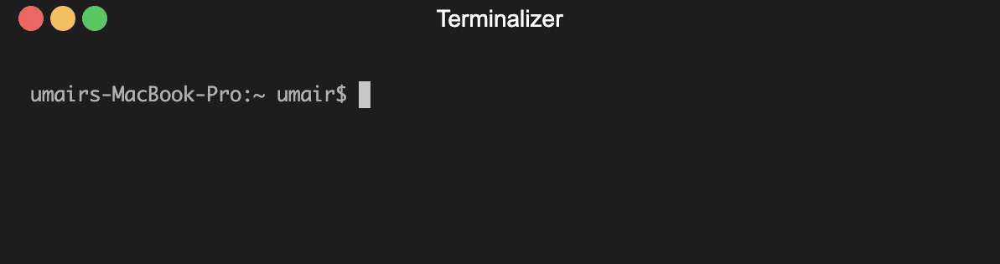

<h1 align="center">Seize</h1>
<p align="center"><b>A Command-line Utility for Generating Images from CLI Outputs</b></p>
<p align="center">
<a href="#description">Description</a> • <a href="#features">Features</a> • <a href="docs/documentation.md">Documentation</a> • <a href="#contactme">Contact Me</a><br><br>


  <a href="https://www.buymeacoffee.com/umair9747" target="_blank"></a>
</p>
<hr>

<hr style="width:300px; height: 1px; margin: auto; margin-top: 20px;" />
<br>
<div id="description">
<h2> Description </h2>
Seize is a Command-line utility tool written in Golang that helps you generate images from CLI outputs by taking inputs from stdin. The tool allows you to specify font and background colors and can also upload the generated images to AWS S3 or DigitalOcean Spaces.
<br><br>
The tool is designed to help users create customized images easily and quickly, with the ability to specify text, font color, and background color. It can upload the generated images to S3-compatible storage solutions, including AWS S3 and DigitalOcean Spaces.
</div>
<hr style="height: 1px;">
<div id="features">
<h2> Features </h2>

<h4> Generate Custom Images </h4>
Seize allows you to create images with custom text, font colors, and background colors by taking inputs from stdin. This makes it easy to visualize CLI outputs or other text data as images.

<h4> Upload to AWS S3 </h4>
Seize can upload the generated images to an AWS S3 bucket. You can specify the necessary AWS credentials and bucket information through environment variables.


<h4> Flexible Color Options </h4>
Seize allows you to specify font and background colors using hex codes, giving you full control over the appearance of the generated images.
</div>

<hr style="height: 1px;">

<div id="installation">
<h2> Installation </h2>
You can install Seize by cloning the repository and building it manually, or by using the `go install` command.

### Clone and Build Manually

```bash
git clone https://github.com/umair9747/seize.git
cd seize
go build
```

### Using `go install`

```bash
go install github.com/umair9747/seize@latest
```

Ensure your `$GOPATH/bin` is in your `PATH`:

```bash
export PATH=$PATH:$(go env GOPATH)/bin
```
</div>

<hr style="height: 1px;">

<div id="usage">
<h2> Usage </h2>

### Basic Usage

```bash
command | seize
```

### Flags

- `-oD`: Directory to save the output image (default: current directory)
- `-oF`: Name of the output image file (default: generated hash)
- `-uP`: Upload the image to an AWS S3 bucket
- `-fC`: Font color in hex (default: white `FFFFFF`)
- `-bC`: Background color in hex (default: dark gray `181414`)

### Environment Variables for Upload

#### AWS S3

- `AWS_ACCESS_KEY_ID`: Your AWS access key ID
- `AWS_SECRET_ACCESS_KEY`: Your AWS secret access key
- `AWS_BUCKET_NAME`: The name of your S3 bucket
- `AWS_REGION`: The AWS region of your bucket

### Example for Upload

To upload the generated image to AWS S3:

```bash
export AWS_ACCESS_KEY_ID=your_aws_access_key
export AWS_SECRET_ACCESS_KEY=your_aws_secret_key
export AWS_BUCKET_NAME=your_aws_bucket_name
export AWS_REGION=your_aws_region

seize -oD ./output -oF image -fC FF0000 -bC 000000 -uP < input.txt
```
</div>

<hr style="height: 1px;">

<div id="contactme">
<h2> Contact Me </h2>
Have any suggestions, queries, feedback or just want to connect with me? Feel free to reach out using the below handles:
<ul type="disc">
<li><a href="https://www.linkedin.com/in/umair-nehri-49699317a">LinkedIn</a></li>
<li><a href="https://twitter.com/0x9747/">Twitter / X</a></li>
</ul>

Also, if you'd like to support me for my future research works, please consider using <a href="https://www.buymeacoffee.com/umair9747">this link</a> for your donations!
</div>
